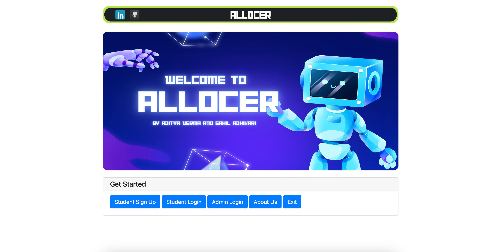
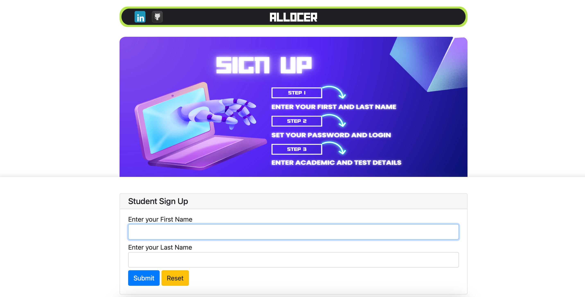
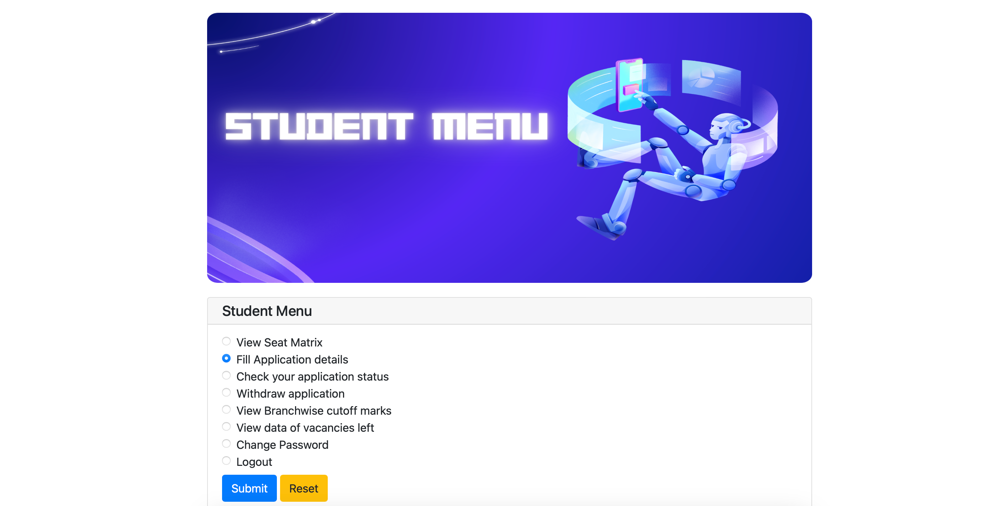
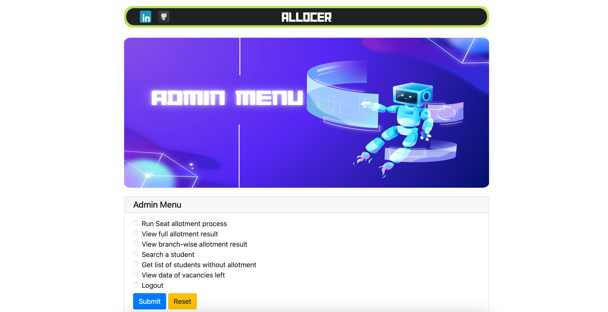
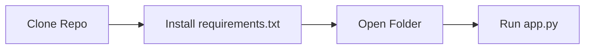

## DermaScan: Advanced Skin Lesion Classifier with Dermatology Chatbot


  <p>

## Project Overview

- This is an *application-based* group project, a part of the DSA (Data Structure and Algorithms) application.
- The project aims to **simulate the admission process** for colleges. Students can apply for a degree program at a college using this system. Allocer is a completely merit-based allotment system. Students are admitted taking into consideration their Common Entrance Test (SRMJEE) marks and course preferences.
- The code is divided into different classes: menu, database, allotment_mechanism. Each file contains a class which has the related data members and functions defined in it. The functionality is divided mainly into 2 parts: For **Admin** and **Student**. Validations are added for all inputs to ensure an error-free experience.

### Features
- Forgot Password: A new temporary password will be emailed to the user.
- Password encryption by using a stronger algorithm.
- Validation of scores entered by the applicant by extracting the score from the uploaded scorecard in PDF form.
- Feature for students that allow them to download their allotment result as a PDF file and Admin feature to download the full allotment result list in the form of PDF.
- Course seat prediction, based on the score by using ML algorithms.
- Show statistics such as acceptance rate per course, gender-wise allocation chart, etc.
- Executing multiple allotment rounds - students will have the option to accept and freeze the allotted seat or try again for improvement in the next round.

 ## Preview

 <table>
  <tr>
    <td>Home</td>
     <td>SignUp</td>
  </tr>
  <tr>
    <td></td>
    <td></td>
  </tr>
  <tr>
     <td>Student Menu</td>
     <td>Admin Menu</td>
  </tr>
  <tr>
    <td></td>
    <td></td>
  </tr>
 </table>


 ## Current Tech Stack 🔻
<div style="display: inline_block"><br>
  
  
  
  
  
  
</div>
  
<div><h2><strong>Developers of this repository 🔻</strong></h2></div>

<table align="center">
<tr align="center">
<td>

**ΛDIƬYΛ VΣЯMΛ**

<p align="center">

</p>
<p align="center">
<a href = "https://github.com/ADITYAVOFFICIAL"></a>
<a href = "https://www.linkedin.com/in/aditya-verma-real/">

</a>
<a href = "https://medium.com/@adityaver">

</a>
</p>
</td>

<td>
𝗦𝗮𝗵𝗶𝗹 𝗔𝗱𝗵𝗶𝗸𝗮𝗿𝗶

<p align="center">

</p>
<p align="center">
<a href = "https://github.com/Sahilopl"></a>
<a href = "https://www.linkedin.com/in/sahil-adhikari-57b445250/">

</a>
</p>
</td>
</table>

 ## Installation
 <div>
 <p>Before running the application, make sure to install the dependencies listed in the 'requirements.txt' file.</p>
   
   ```
   pip install -r requirements.txt
   ```

<p>Running website on Local Host</p>




 </div>

 ## Current Contributors 🔻
<div align="center">
  <a href="https://github.com/ADITYAVOFFICIAL/Allocer/graphs/contributors">
  
</a>
</div>
