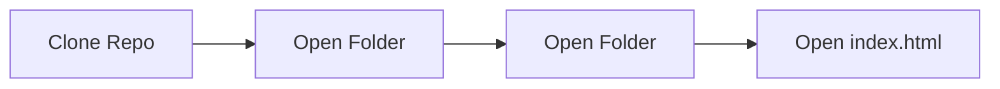

## DermaScan: Advanced Skin Lesion Classifier with Dermatology Chatbot


  <p>
    <ul>
            <li>The code is divided into different classes: menu, database, allotment_mechanism. Each file contains a class with related data members and functions defined in it.</li>
            <li>The functionality is divided into two main parts: for Admin and Student. Validations are added for all inputs to ensure an error-free experience.</li>
            <li>The system efficiently carries out seat allocation for 500+ student records currently present in the database.</li>
            <li>Passwords are encrypted with a simple Caesar-cipher algorithm before saving in the datasheet.</li>
        </ul>

 ## Build Status
 [](https://app.netlify.com/sites/derma-scan/deploys)

 ## Preview

 <table>
  <tr>
    <td>Welcome page</td>
     <td>Sign up page</td>
  </tr>
  <tr>
    <td></td>
    <td></td>
  </tr>
  <tr>
     <td>Student Menu</td>
     <td>Admin Menu</td>
  </tr>
  <tr>
    <td></td>
    <td></td>
  </tr>
 </table>


 ## Current Tech Stack 🔻
<div style="display: inline_block"><br>
  
  
  
  
  
  
  
  
  
  
  
  
  
  
  
  
</div>
  
<div><h2><strong>Developers of this repository 🔻</strong></h2></div>

<table align="center">
<tr align="center">
<td>

**ΛDIƬYΛ VΣЯMΛ**

<p align="center">

</p>
<p align="center">
<a href = "https://github.com/ADITYAVOFFICIAL"></a>
<a href = "https://www.linkedin.com/in/aditya-verma-real/">

</a>
<a href = "https://medium.com/@adityaver">

</a>
</p>
</td>

<td>
𝗦𝗮𝗵𝗶𝗹 𝗔𝗱𝗵𝗶𝗸𝗮𝗿𝗶

<p align="center">

</p>
<p align="center">
<a href = "https://github.com/Sahilopl"></a>
<a href = "https://www.linkedin.com/in/sahil-adhikari-57b445250/">

</a>
</p>
</td>
</table>

 ## Installation
 <div>
 <p>Before running the Jupyter Notebook for the model, make sure to install the dependencies listed in the 'requirements.txt' file.</p>
   
   ```
   pip install -r requirements.txt
   ```

<p>Running website on Local Host</p>




 </div>

 ## Current Contributors 🔻
<div align="center">
  <a href="https://github.com/ADITYAVOFFICIAL/Allocer/graphs/contributors">
  
</a>
</div>
